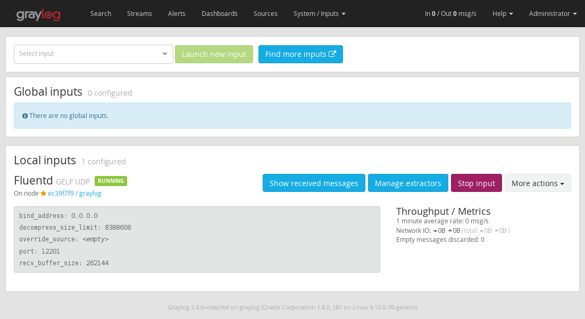

# Fluentd with elasticsearch and graylog 

This project is a fork from https://github.com/digikin/fluentd-elastic-kibana and its indent to run Fluentd and Graylog

## How to run?

1. Run `docker-compose up -d --build` to start all services

2. Wait until Graylog be up and running.

3. You will need to prepare Graylog to receive fluentd logs, go to http://localhost:9000 and log into the web interface, the default user and password are both `admin`.
Once logged in, click on `System` in the top nav. Next, click on `Inputs` from the left navigation bar. (Or, simply go to http://localhost:9000/system/inputs)
Then, from the dropdown, choose `GELF UDP` and click on `Launch new input`, which should pop up a modal dialogue, Select the `Node` and fill the `Title`. Then, click `Save`.  

4. Make requests to receive some data with `curl localhost` or run `./test.sh` that will perform a request for second in loop.

## Files
### docker-compose.yaml
```
version: '3'
services:
  web:
    image: httpd
    ports:
      - "80:80"
    links:
      - fluentd
    logging:
      driver: "fluentd"
      options:
        fluentd-address: localhost:24224
        tag: httpd.access

  fluentd:
    build: ./fluentd
    networks:
      - graylog
    ports:
      - "24224:24224"
      - "24224:24224/udp"

  # MongoDB: https://hub.docker.com/_/mongo/
  mongo:
    image: mongo:4.2
    networks:
      - graylog

  # Elasticsearch: https://www.elastic.co/guide/en/elasticsearch/reference/7.10/docker.html
  elasticsearch:
    image: docker.elastic.co/elasticsearch/elasticsearch-oss:7.10.2
    environment:
      - http.host=0.0.0.0
      - transport.host=localhost
      - network.host=0.0.0.0
      - "ES_JAVA_OPTS=-Xms512m -Xmx512m"
    ulimits:
      memlock:
        soft: -1
        hard: -1
    deploy:
      resources:
        limits:
          memory: 1g
    networks:
      - graylog

  # Graylog: https://hub.docker.com/r/graylog/graylog/
  graylog:
    image: graylog/graylog:4.0
    environment:
      # CHANGE ME (must be at least 16 characters)!
      - GRAYLOG_PASSWORD_SECRET=somepasswordpepper
      # Password: admin
      - GRAYLOG_ROOT_PASSWORD_SHA2=8c6976e5b5410415bde908bd4dee15dfb167a9c873fc4bb8a81f6f2ab448a918
      - GRAYLOG_HTTP_EXTERNAL_URI=http://localhost:9000/
    entrypoint: /usr/bin/tini -- wait-for-it elasticsearch:9200 --  /docker-entrypoint.sh
    networks:
      - graylog
    restart: always
    depends_on:
      - mongo
      - elasticsearch
    ports:
      # Graylog web interface and REST API
      - 9000:9000
      # Syslog TCP
      - 1514:1514
      # Syslog UDP
      - 1514:1514/udp
      # GELF TCP
      - 12201:12201
      # GELF UDP
      - 12201:12201/udp
networks:
  graylog:
    driver: bridge
```
### fluent.conf
```
# fluentd/conf/fluent.conf
<source>
  @type forward
  port 24224
  bind 0.0.0.0
  tag graylog2
</source>

<match graylog2.**>
  @type gelf
  host graylog
  port 12201
  <buffer>
    flush_interval 5s
  </buffer>
</match>
```
### Dockerfile 
```
FROM fluent/fluentd:v1.12.0-debian-1.0
USER root
RUN ["gem", "install", "fluent-plugin-gelf-hs", "--no-document", "--version","1.0.8"]
ADD conf /fluentd/etc
USER fluent
```


## References

* https://docs.fluentd.org/how-to-guides/graylog2
* https://docs.graylog.org/en/4.0/pages/installation/docker.html
